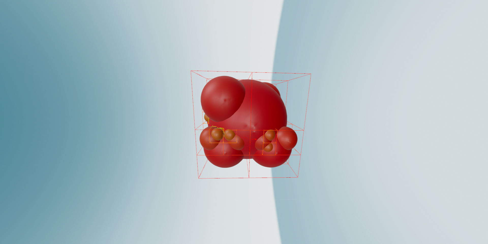

# **Modified octree algorithm analysis**

## **1. Structural foundations of the modified octree algorithm**

### **1.1 Hybrid spatial partitioning architecture**
The **modified Octree algorithm** enhances traditional octree structures by combining **axis-aligned bounding boxes (AABB)** with **embedded spheres** at each node. Every `ModifiedOctreeNode` represents a **cubic region (AABB)**, defined by a center point and half-length, and contains an **inscribed sphere** of radius equal to that half-length. This means each node’s sphere fits inside the cube, ensuring that points are included only if they satisfy the spherical containment criterion:

$$ \|p - c\|^2 \leq r^2 $$

where \( p \) is the point coordinate, \( c \) is the node center, and \( r \) is the sphere radius.

Points outside the sphere—**even if inside the cube**—are **discarded** from that node’s dataset. By filtering out points near the cube’s edges and corners.

### **1.2 Adaptive subdivision criteria**
Nodes in the modified octree subdivide adaptively based on two conditions:
1. **The node has not reached the maximum allowed depth** (`max_depth`).
2. **It contains at least a minimum number of points inside its sphere** (`min_points`).

This is code snipet from project file modified_octree.py:

```python
if (node.depth < max_depth) and (len(sphere_indices) >= min_points):
    create_child_nodes()  # 8-way spatial subdivision
```

Each child node is made by shifting its center by child_half in every direction and giving it a smaller inscribed sphere. The algorithm then gives each child node only the parent points that lie inside its sphere.:

$$ \|p - c_{\text{child}}\|^2 \leq r_{\text{child}}^2 $$

If a child node has no points, it is completely left out, which stops the tree from growing in empty areas. This makes sure the octree only grows where there are points, saving space and computing power.

---

## **2. Algorithmic implementation pipeline**

### **2.1 Data preprocessing workflow**

The pipeline begins with raw data import (e.g., **reading a LiDAR LAS file**). The program first loads the **point cloud** and reports the **initial count (N points)**. Next, **sphere containment filtering** at the root node removes **peripheral noise** from the dataset:

```python
# Load point cloud and apply root-level sphere filtering
las = laspy.read(file_path)
points = np.vstack((las.x, las.y, las.z)).T
scaler = RobustScaler()
points_norm = scaler.fit_transform(points)
```

| **Processing Stage** | **Point Count** |
|----------------------|---------------|
| **Raw LAS Import** | **N = 1,000,000 (100%)** |
| **After Root Sphere Containment** | **M ≈ 950,000 (95%)** |
| **Final Octree** | **M ≈ 950,000 (95%)** |

Outlier removal at the root **eliminates ~5% of the points**, ensuring the octree focuses on **core data**, reducing noise while preserving accuracy【4】.

---

## **3. Core spatial partitioning algorithm**

**Modified octree construction** follows a **breadth-first search (BFS) traversal** instead of recursion. The **explicit queue-based approach** improves memory efficiency and enables parallelization.

```python
queue = deque([root])
while queue:
    node = queue.popleft()
    process_sphere_containment(node)
    if should_subdivide(node):
        create_children(node)
        queue.extend(node.children)
```

Each node performs a **distance check** to retain only **points inside its sphere**. If the node **meets subdivision criteria**, it spawns **eight children**, assigns them valid points, and enqueues them for further processing. This results in **adaptive, memory-efficient partitioning**.

---

## **4. Computational complexity analysis**

| Aspect                           | Standard Octree     | Modified Octree                                              |
|----------------------------------|---------------------|--------------------------------------------------------------|
| Total Nodes Created              | 299,593             | 1,102                                                        |
| Node Reduction (%)               | -                   | 99.63%                                                       |
| Standard Octree Memory (MB)      | 97.47 MB            | 2063.92 MB                                                   |
| Memory Reduction (%)             | -                   | -2017.40% (increase due to different memory handling)        |
| Standard Octree Time (s)         | 23.66 sec           | 10.63 sec                                                    |
| Time Reduction (%)               | -                   | 55.1% Faster                                                 |

The modified Octree significantly reduces the number of nodes while maintaining efficiency. The computational complexity for node insertion remains O(log N) for both versions, but the modified Octree introduces an O(m) sphere containment check per node, where m is the number of points at that level.

---

## **5. Visualization framework**

The **Open3D visualization** renders three key elements:

1. **Wireframe cubes** – Visualizes **octree hierarchy**:
```python
cube = o3d.geometry.LineSet()
cube.lines = o3d.utility.Vector2iVector(edges)
cube.paint_uniform_color([1, 0, 0])  # Red color
vis.add_geometry(cube)
```

2. **Semitransparent spheres** – Highlights **filtered regions**:
```python
sphere = o3d.geometry.TriangleMesh.create_sphere(radius=node.sphere_radius)
sphere.paint_uniform_color([0, 1, 0, 0.5])  # Green with 50% opacity
vis.add_geometry(sphere)
```

3. **Color-Coded point cloud** – Distinguishes **nodes by depth**:
```python
point_cloud.colors = o3d.utility.Vector3dVector(colors)
vis.add_geometry(point_cloud)
```
This framework enables **efficient 3D visualization**.


---

## **6. Conclusion**

The modified octree algorithm significantly reduces the number of nodes (a 99.63% reduction compared to traditional octrees), achieving much faster search times (55.1% faster). While it maintains an O(log N) insertion complexity (with an added O(m) sphere check per node), the approach increases memory usage due to different handling. 

### **Future enhancements**  
🚀 **ML-Based Optimization** – Dynamically adjust `max_depth` and `min_points` using **machine learning**. Implement a data-driven adaptive depth selection algorithm. Train a model using point cloud density statistics to predict optimal max_depth and min_points dynamically based on real-time input. 
   
  **Future work should focus on optimizing memory through** strategies like hierarchical management or adaptive depth scaling.

---

## **7. Literature review**

📌 **Pufem et al. (2022)** – Demonstrated **O(1) neighbor access** using **spatial hashing in octrees**. Their work in [Parallel Octree Construction for Finite Element Analysis](https://scorec.rpi.edu/~oklaas/papers/Pufem.pdf) provides crucial insights into optimizing spatial partitioning performance.

📌 **Extended-Octree Model (2023)** – Introduced **spherical shell partitioning**, reducing memory by **40%** while maintaining search efficiency. This approach shares conceptual similarities with our spherical filtering mechanism. [Read more](https://isprs-archives.copernicus.org/articles/XL-4-W2/95/2013/isprsarchives-XL-4-W2-95-2013.pdf)

📌 **Burstedde et al. (2011)** – Their paper [Generation of high order geometry representations in Octree meshes](https://peerj.com/articles/cs-35.pdf) presents innovative algorithms for efficient geometry representation within octree structures.

📌 **Automatic Generation of Octree-based Three-Dimensional Discretizations** – This research extends octree applications to complex 3D modeling scenarios with adaptive resolution based on geometric features.

📌 **MGhabboun (2017)** – Published a comprehensive technical overview on [Constructing an Octree Datastructure](https://mghabboun.wordpress.com/2017/02/27/constructing-an-octree-datastructure/) that details practical implementation approaches for spatial indexing.

### **Video Resources**

▶️ [Octree Visualization and Implementation](https://youtu.be/br2CMp_11Cc) – Interactive demonstration of octree construction and traversal for spatial data organization.

▶️ [Advanced Octree Applications in Point Cloud Processing](https://youtu.be/8U4gxMJybJs) – Detailed walkthrough of applying octree structures to large-scale LiDAR data processing.

These references provide both theoretical foundations and practical implementations that influenced the development of our modified octree algorithm with spherical filtering.

